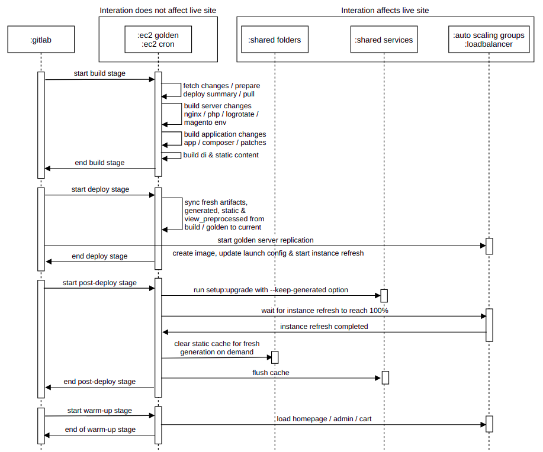

# Gitlab CI/CD pipeline with aws integration for magento 2 deployment

# Feature highlights
- Created with simplicity and ease of use in mind, inspired by magento cloud pipeline
- Emphasis on zero downtime during deployment
- Separate root to build application changes without affecting mage root
- State checking flow for optimized build of pipeline/server/application related changes
- Simple deploy summary for pipeline/server/application section in tabular format during each deployment
- Support to sync nginx, php, logrotate and magento env changes directly from repository to golden server
- Composer auto update flow when last update run exceeds 30 days during deployment even without any changes
- Patches install complete flow to auto apply, revert and delete relevant changes
- Aws cli integration to create image, update launch configuration and start/wait for instance refresh

# Important configuration information
- Part of static `pub/static` on efs causes massively slow static deployment so it should not been kept on efs
- Part of static `var/view_preprocessed` will be on efs due to entire `var` being efs, so custom configuration will be done later on to remedy massively slow static deployment
- Part of static `pub/static/_cache` should for now be in efs as it generates only on demand and not sharing it breaks layout
  [static cache bug](https://github.com/magento/magento2/issues/13225)
- Crontab for `root` and `ubuntu` user will be auto deleted on auto scaling nodes to avoid conflicting cron runs, this effectively allows golden server to be also used as a dedicated cron server. It is achieved using launch configuration user data.

# Contents overview
1. [Project sequence diagram](#1-project-sequence-diagram)
2. [Pre-Requistices](#2-pre-requistics)
3. [Configure repository and user for deployment](#3-configure-repository-and-user-for-deployment)
4. [Configure gitlab server](#4-configure-gitlab-server)
5. [Configure golden server](#5-configure-golden-server)
6. [Usage of pipeline and extra information](#6-usage-of-pipeline-and-extra-information)

# 1. Project sequence diagram


# 2. Pre-Requistics
- Proper credentals/vpn to ssh into staging/production ec2 servers
- Magento 2 existing project installed and running on staging/production ec2 server
- These folders mounted on efs `app/etc`, `var` and `pub/media` in ec2 server mage root
- All services endpoint accessible from staging/production ec2 server
- Proper credentals to ssh into gitlab hosted server
- Gitlab installed/running, magento repository configured in gitlab and two gitlab shell runner configured
- Access to all relevant aws credentals and aws cli installed and configured in gitlab/staging/production server
- Ssl configured using `ssl termination` externally from loadbalancer side

# 3. Configure repository and user for deployment
- Clone this repository in your pc and cd into it
- Follow steps below to configure repository for [existing](#existing-magento-repository) and [cloud](#repository-for-cloud)
- Follow steps below to configure a new [new user](#user-for-deployment)  for deployment

## Existing magento repository
- Add the config samples to your existing magento repository, replace `$path_to_your_project` with your project path
```
cp .gitlab-ci.yml.dis $path_to_your_project/.gitlab-ci.yml
cp .gitignore.dis $path_to_your_project/.gitignore
cp .rsyncignore.dis $path_to_your_project/.rsyncignore
cp -r .ec2.dis $path_to_your_project/.ec2
```
- Modify `.gitignore` file as needed
- `.ec2/shared` has config samples which will be shared between staging/production, modify as needed
- The php logs path has been modified to `/var/log/php/php*.log`, recommended to do similar in your server php fpm config
- `.ec2/production` has config samples for production only, replace `$domain_name` with your domain name in file names and file contents
- Replace all `$variable` in `.ec2/production/magento/env.php` file with production services information
- `.ec2/staging` has config samples for staging only, replace `$domain_name` with your domain name in file names and file contents
- Replace all `$variable` in `.ec2/staging/magento/env.php` file with staging services information
- Commit changes and push to your existing magento respository, pipeline will be skipped as it's restricted to specefic branches.

## Repository for cloud
- Create a new repository preferably with `cloud` suffix to your existing repository name, example `company-magento-cloud`
- Delete default `master` branch and create two new branches as `staging` and `production`
- Clone your updated existing magento repository into these two new branches
- Keep `production` branch as default/protected, `staging` branch can be left unprotected to allow force pushes
- Restrict the two gitlab runner created to this project and add `production` in tags to one and `staging` in tags to another
- Configure production gitlab runner to only run on pipelines triggered on protected branches for security

## User for deployment
- Create a new user in gitlab with username `deployer` and fullname preferably as `Aws Cloud`
- Give this user access to the new repository created for cloud
- Create two ssh keypair and add the public keys to `ssh keys` in user setting named `ec2 production` and `ec2 staging`
- Copy the private key of ssh kepair to respective ec2 production/staging server `~/.ssh` folder and rename as `gitlab`
- The deployer user and keypair will later be used for paswordless git operations over ssh.

# 4. Configure gitlab server
- Follow steps below to configure [gitlab-runner user](#configure-gitlab-runner-user), [ssh](#configure-ssh) and [this repository](#configure-this-repository-for-gitlab)

## Configure gitlab-runner user
- Setup a password for `gitlab-runner` user and add it to `sudo` group, all operations in gitlab server will use this user by default
- Login into gitlab server using `gitlab-runner` user and created password
- Copy your vpn file to `/etc/openvpn/client` and add this entry in sudoders file for passwordless commands for openvpn
```
# Passwordless sudo commands
gitlab-runner ALL=NOPASSWD: /usr/sbin/openvpn, /usr/bin/pkill
```

## Configure ssh
- Create a ssh `config` file in `~/.ssh` and add these entries, replace `$host_ip` with ssh ip of each servers and `$key_name` with key name
```
Host production_golden
    User ubuntu
    HostName $host_ip
    IdentityFile ~/.ssh/$key_name.pem

Host staging_golden
    User ubuntu
    HostName $host_ip
    IdentityFile ~/.ssh/$key_name.pem
```
- Start the vpn using `sudo openvpn $cloud_aws` and make sure vpn is connected and did not require sudo password
- Ssh into each of the ssh alias created above manually firstime to cache the fingerprint, replace `$ssh_alias_name` with host alias from above
```
ssh $ssh_alias_name
```
- Once ssh into every server is working and cached, close the vpn using `sudo pkill openvpn` and make sure it did not require sudo password

## Configure this repository for gitlab
- Clone this repository in home folder of user
- Add some variables in `/etc/environment` for pipeline commands alias, replace `$vpn_name` with your own
```
# Aws Openvpn config
cloud_aws="--config /etc/openvpn/client/$vpn_name.ovpn"

# Root path
scripts_root="/home/gitlab-runner/gitlab-aws-magento2-deploy/scripts/gitlab"
```
- Cd into `$scripts_root` and create two .env file for staging and production from sample env file
```
cp -a .env.dis .env.prod
cp -a .env.dis .env.stag
```
- Edit each of the `.env` file and add `production` or `staging` aws related details

# 5. Configure golden server
- Redo these steps for each golden server `production` and `staging`
- Follow steps below to configure [mage/build root and ssh](#configure-magebuild-root-and-ssh) and [this repository](#configure-this-repository-for-golden)

## Configure mage/build root and ssh
- Checkout the specefic instance branch `production`/`staging` from the repository created for cloud in your `mage root`
- Create an additional local only deploy branch named `deploy` in your `mage root` which will allow build stage to be retryed with changes
- Create a ssh `config` file in `~/.ssh` and add these entry, replace `$gitlab_domain` with your own, `$host_ip` with it's ip and `$key_name` with key name
```
Host $gitlab_domain
   HostName $host_ip
   IdentityFile ~/.ssh/$key_name.pem
```
- Cd into your current `mage root` and change the git remote to ssh one instead of https, now all git commands should work through ssh
- Create a new folder in `/var/www/html` as `build` and copy over `.git` and `.gitignore` from mage root
- Run `composer install` in `build` folder to install all packages, make sure `config.php` is also present in `app/etc` if not already
- Magento build operations can be done without any services connection so `env.php` is not required in `app/etc`
- Create a symbolic link for `view_preprocessed` outside `var` to non-efs folder in `build` folder
```
rm -rf var/view_preprocessed
mkdir -p symlinks/view_preprocessed
cd var && ln -snf ../symlinks/view_preprocessed .
```
- Modify `pub/index.php` section to use custom `view_preprocessed` as follows
```
$tmpMaterializationDir = dirname(__DIR__, 1).'/symlinks/view_preprocessed/pub/static';
$params = $_SERVER;
$params[Bootstrap::INIT_PARAM_FILESYSTEM_DIR_PATHS] = array_replace_recursive(
    $params[Bootstrap::INIT_PARAM_FILESYSTEM_DIR_PATHS] ?? [],
    [
        DirectoryList::PUB => [DirectoryList::URL_PATH => ''],
        DirectoryList::MEDIA => [DirectoryList::URL_PATH => 'media'],
        DirectoryList::STATIC_VIEW => [DirectoryList::URL_PATH => 'static'],
        DirectoryList::UPLOAD => [DirectoryList::URL_PATH => 'media/upload'],
        DirectoryList::TMP_MATERIALIZATION_DIR => [DirectoryList::PATH => $tmpMaterializationDir]
    ]
);

```
- Remove these files from current `mage root`, they can be left undeleted but serves no purpose in this pipeline from `mage root`
```
rm -r .ec2 .git .gitignore .gitlab-ci.yml
```
- Rsync your `build root` changes to `mage root`
```
sudo rsync -a --exclude-from=".rsyncignore" $build_root/ . --delete
```
- Since `var` and `symlinks` is skipped for rsync, create a symbolic link for `view_preprocessed` outside `var` to non-efs folder in `mage root` as well
```
rm -rf var/view_preprocessed
mkdir -p symlinks/view_preprocessed
cd var && ln -snf ../symlinks/view_preprocessed .
```

## Configure this repository for golden
- Clone this repositrory in home folder of user
- Add some variables in `/etc/environment` for pipeline commands alias, replace `$domain_name` with your project domain name
```
# Root path
mage_root="/var/www/html/$domain_name"
build_root="/var/www/html/build"
scripts_root="/home/ubuntu/gitlab-aws-magento2-deploy/scripts/ec2"

```
- Cd into `$scripts_root` and create two .env file for staging and production from sample env file
```
cp -a .env.dis .env.prod
cp -a .env.dis .env.stag
```
- Edit each of the `.env` file and add `production` or `staging` aws/magento related details

# 6. Usage of pipeline and extra information
- After setting up everything from previous steps, make some changes in previous already existing repository, commit and push changes
- Clone the new repository for cloud in seperate isolated folder and pull changes of previous repository in one of the branches preferably `staging`
- Push the changes to relevant branch, the pipeline should trigger, run it's operations and complete if everything was setup up properly
- Symbolic linked `view_preprocessed` in `var` will be used by `static deployment` command while modified `view_preprocessed` in `pub/index.php` will be used by `nginx`
- Admin configuration `Enable Symlinks` does not need to be enabled, it's only needed for read operations while write operations can be done safetly with this disabled
- To force application build even without changes use the web ui `run pipeline` and set `FORCE_APPLICATION_BUILD` to `1` or set this variable to `1` during git push
```
git push origin $branch_name -o ci.variable="FORCE_APPLICATION_BUILD=1"
```